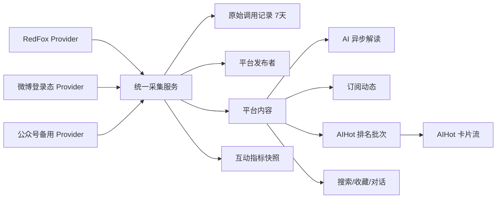

# AIHot 与社媒数据源重构设计

## 1. 结论

D-sight 应把现有公众号、微博采集与新增的小红书、B站接入重构为一套统一的社媒内容供给系统，并在其上建立两个用途不同、数据可复用的产品：

- **订阅动态**：用户主动订阅账号后，按发布时间阅读最新内容。
- **AIHot**：平台管理员维护金融信源池，系统从公众号、小红书、B站拉取内容并形成单一的跨平台金融热门卡片流。

7×24h 不纳入这次统一：它继续作为新浪财经实时新闻流，回答“刚刚发生了什么”；AIHot 回答“金融内容中现在什么最热”。

首期使用 RedFox 作为公众号、小红书和 B站的首选数据提供方，但所有调用必须经过 Provider Adapter，不能让数据库、API 或 UI 直接依赖 RedFox 字段。微博继续使用现有低频登录态采集。现有公众号扫码采集保留为关闭的迁移备用通道，验证 RedFox 覆盖率后再决定是否移除。

## 2. 从参考项目借鉴什么

参考项目 `insprira` 是自媒体运营工作台，不适合整体照搬。它对 D-sight 最有价值的是内容供给闭环。

### 值得借鉴

1. **普通平台榜与垂直主题榜分离**

   参考项目不仅有抖音、小红书、公众号普通榜，还通过 `source + keyword/msgType + 时间窗` 提供 AI、短剧、文旅等垂直榜。AIHot 应借鉴垂直主题榜：由金融信源池定义候选范围，而不是从全站热榜中硬过滤金融关键词。

2. **每次采集形成批次快照**

   一次调用保存为一个 batch，记录请求、状态、条目数、时间与错误；失败和空数据不能覆盖最近一次成功批次。这直接支持排名变化、数据新鲜度与故障降级。

3. **数据源配置与主流程分离**

   新平台只增加 Provider Adapter 和配置，不修改榜单主流程。

4. **真实指标与 AI 分析分离**

   热度来自平台排名、互动和时间；AI 只负责摘要、分类、实体识别与相关性判断。

5. **缓存、端点允许列表和调用统计**

   所有 RedFox 请求经服务端代理，统一记录耗时、状态、是否命中缓存及估算费用。

6. **历史快照产生趋势**

   排名上升、下降和新上榜来自相邻快照差异，而不是让模型猜测。

### 不应照搬

- 不采用按平台动态 Tab；AIHot 只显示一个跨平台卡片流。
- 不复制参考项目面向自媒体创作的选题、改写、账号诊断等产品模块。
- 不在业务代码中硬编码 RedFox 的 `source` 字符串和响应字段。
- 不为每个平台复制一套账号、内容、订阅和任务表。
- 不把 SQLite 单进程调度方式直接移植到 D-sight 的 PostgreSQL/FastAPI 架构。

## 3. 产品边界

| 产品 | 内容范围 | 排序 | 用户控制 | 数据源 |
|---|---|---|---|---|
| 7×24h | 新浪财经实时快讯 | 发布时间倒序 | 搜索、选择后分析 | 新浪财经 |
| 订阅动态 | 用户订阅账号的全部新内容 | 发布时间倒序 | 用户增删订阅 | RedFox + 微博登录态 + 公众号备用通道 |
| AIHot | 管理员金融信源池中的热门内容 | AIHot 排名 | 用户筛选、搜索、收藏、分析 | 首选 RedFox 金融聚合接口 |

一篇平台内容可以同时出现在订阅动态和 AIHot，但数据库只保存一份内容。订阅关系和热榜排名分别引用它。

## 4. AIHot 产品设计

### 4.1 导航与信息架构

侧边栏顺序：

1. 对话
2. 7×24h
3. **AIHot**
4. 社媒信息
5. 知识库
6. 技能市场
7. 基金套利

AIHot 页面副标题使用“金融热榜”。页面不出现“综合榜、公众号榜、小红书榜、B站榜”等平台分区。

### 4.2 页面布局

```text
┌ AIHot · 金融热榜                 更新于 10:00  [刷新] ┐
│ [24小时] [3天] [7天]  [全部][宏观][政策][行业][公司][市场] │
│ [搜索标题、作者、股票或资产……]                          │
├───────────────────────────────────────────────────────┤
│  #1 ↑3  卡片             #2 NEW 卡片       #3 ↓1 卡片  │
│  标题                     标题              标题        │
│  AI 一句话摘要            AI 一句话摘要     AI 一句话摘要│
│  作者 · 平台 · 时间       作者 · 平台 · 时间            │
│  核心互动指标  资产标签   核心互动指标      资产标签     │
└───────────────────────────────────────────────────────┘
```

- 桌面端三列卡片，窄屏两列，移动端一列。
- 默认最近 24 小时 Top 50，可切换 3 天、7 天。
- 不无限滚动历史；超过 7 天的内容通过搜索或收藏访问。
- 平台只以小标签呈现，不提供平台 Tab 或平台筛选。
- 卡片不突出展示难理解的 0–100 分数，只展示排名、趋势和一个核心互动指标。

### 4.3 卡片字段

- 当前排名。
- `新上榜 / ↑N / ↓N / 持平`。
- 标题与封面缩略图。
- AI 一句话摘要。
- 发布者、平台、发布时间。
- 平台核心指标：公众号阅读/点赞、小红书互动、B站播放/点赞等。
- 金融分类与资产标签。
- 数据新鲜度；使用旧快照时显示缓存状态。

### 4.4 详情抽屉

点击卡片后从右侧打开抽屉，保持卡片流滚动位置。抽屉包含：

- 完整正文或视频字幕。
- 原文链接与来源信息。
- AI 摘要、金融分类、资产标签。
- 当前排名、排名历史与排序依据。
- 收藏。
- 发送到对话。
- 深度分析。

页面不常驻右侧 AI 对话区，避免压缩卡片墙。

## 5. 社媒信息重构

社媒页面从“公众号 Tab + 微博 Tab”改成统一的“订阅动态”。

### 5.1 页面结构

- 左侧：全部已订阅账号，可按名称搜索；账号显示平台标签和最近同步状态。
- 中间：跨平台内容时间流；选择某个账号时只显示该账号内容。
- 右侧抽屉：完整内容、原文、收藏和发送到对话。
- 顶部添加账号：先选择平台，再通过 RedFox 或对应 Provider 搜索并订阅。

### 5.2 首期平台

- 公众号：RedFox 首选，现有扫码采集关闭备用。
- 微博：现有专用登录态低频采集。
- 小红书：RedFox 搜索发现（无账号作品列表接口，订阅降级为搜索发现）。
- B站：RedFox。

用户添加的订阅不会自动进入公共金融信源池。只有管理员可以改变 AIHot 候选范围。

**小红书特殊处理**：
- 订阅动态：用户搜索小红书关键词，系统定期搜索并展示相关作品
- AIHot：通过搜索关键词（"金融""股票""基金"等）采集小红书金融内容
- 不支持订阅特定小红书账号获取全部作品

## 6. 系统结构



### 6.1 Provider Adapter

统一接口至少覆盖：

- `search_publishers(platform, query)`
- `fetch_publisher(platform, external_id)`
- `fetch_publisher_items(publisher_ref, cursor/since)`
- `fetch_item_detail(item_ref)`
- `fetch_vertical_hot_feed(source_key, window)`
- `capabilities(platform)`

每个 Provider 返回统一 DTO，原始响应单独保存，不能让 RedFox 字段穿透到路由或前端。

能力缺失必须显式表达。例如小红书若不支持账号作品列表，`capabilities` 返回 false，产品不伪装成功，改走金融聚合接口或禁用该入口。

### 6.2 首期 Provider 能力矩阵

基于 Phase 0 门禁验证（2026-08-10）：

| 平台 | 账号搜索 | 账号作品列表 | 内容详情 | 金融聚合榜 | 首期结论 |
|---|---|---|---|---|---|
| 公众号 / RedFox | ✅ searchUser | ✅ queryWorkList | ✅ queryWorkDetail | ❌ 无 | 可接入，订阅动态+AIHot |
| 小红书 / RedFox | ✅ searchUser | ❌ **无此接口** | ✅ queryWorkDetail | ❌ 无 | 可接入搜索发现，订阅降级 |
| B站 / RedFox | ✅ accountSearch | ✅ accountWorkList | ✅ | ❌ 无 | 可接入，订阅动态+AIHot |
| 微博 / RedFox | 尚未上线 | 尚未上线 | 尚未上线 | 无 | 继续现有 Provider |

**关键发现**：
1. **小红书无账号作品列表接口**：无法订阅特定小红书账号获取全部作品。订阅动态降级为搜索发现，AIHot 通过搜索关键词采集。
2. **无金融聚合榜接口**：RedFox 不提供按金融主题聚合的热榜。AIHot 需通过搜索关键词 + 自有排名公式实现。
3. **所有接口均为 POST**，路径格式 `/story/api/{平台}/{操作}`，认证头 `REDFOX_API_KEY`。

RedFox 金融公众号、金融小红书、金融 B站三个聚合接口不存在，AIHot 必须通过搜索关键词采集金融内容。

## 7. 统一数据模型

### 7.1 核心表

#### `social_publishers`

平台发布者主表。

- `id`
- `platform`
- `external_id`
- `name/avatar/description/profile_url`
- `provider`
- `provider_ref`
- `last_synced_at/last_sync_status/last_sync_error`
- `platform_metadata`：JSONB。平台特有字段：
  - 公众号：`{"fakeid": "..."}`
  - 微博：`{"container_id": "...", "uid": "..."}`
  - 小红书/B站：Provider 返回的原始标识
- `created_at/updated_at`
- 唯一约束：`(platform, external_id)`

#### `social_items`

公众号文章、微博、笔记、视频的统一内容表。

- `id`
- `publisher_id`
- `platform`
- `external_id`
- `content_type`: `article/post/video`
- `title`：Text 类型；公众号文字消息无标题时全文写入 title（与现有行为一致）
- `body_text`：Text 类型。**语义约定**：
  - 公众号：`html_to_text(content)` 处理后的纯文本，懒抓填充
  - 微博：原始 HTML（与现有 `weibo_posts.content` 一致）
  - 小红书笔记：正文文本 + 图片描述文本，空格拼接
  - B站视频：简介/描述文本
- `transcript_text`：Text 类型，仅 video 类内容（B站字幕/小红书视频字幕）
- `digest`
- `url/cover_url`
- `published_at/first_seen_at/updated_at`
- `body_fetched_at/body_expires_at`
- `content_hash`：SHA256(title + body_text + url)，用于去重判定。同一内容被多个 Provider 返回时，通过 hash 匹配避免重复入库
- `enrichment_status`：`pending / processing / done / failed`
- `platform_metadata`：JSONB。存放平台特有字段，不参与业务逻辑：
  - 公众号：`{"fakeid": "..."}`
  - 微博：`{"bid": "...", "media": [...], "container_id": "...", "captured_at": "..."}`
  - 小红书/B站：Provider 返回的原始字段
- 唯一约束：`(platform, external_id)`

#### `social_item_metric_snapshots`

不同时间点的互动指标，不把易变指标覆盖在内容主表中。

- `item_id/captured_at`
- `view_count/like_count/comment_count/share_count/collect_count`
- `provider_rank`
- `raw_metrics`：JSONB。各平台特有指标，不参与跨平台排名：
  - 公众号：`{"read_count": 10000, "like_count_original": 200}`
  - 微博：`{"repost_count": 500}`（转发 ≠ share_count）
  - 小红书：`{"collect_count_original": 300}`
  - B站：`{"coin_count": 50, "danmaku_count": 200, "play_count": 5000}`（play_count 存入 view_count）
- 索引：`(item_id, captured_at desc)`

#### `social_subscriptions`

- `user_id/publisher_id`
- `enabled/created_at`
- 唯一约束：`(user_id, publisher_id)`

#### `hot_source_memberships`

公共金融信源池成员。

- `publisher_id`
- `enabled`
- `categories`
- `priority`
- `added_by/created_at`
- 唯一约束：`publisher_id`

#### `hot_runs`

一次 AIHot 拉取批次。

- `id/provider/source_key/window_start/window_end`
- `status`: `running/success/empty/failed`
- `item_count/started_at/completed_at/error`
- `provider_request_id/cost_units`

#### `hot_rankings`

- `run_id/item_id`
- `rank/previous_rank/rank_delta`
- `platform_score/freshness_score/momentum_score/final_score`
- 唯一约束：`(run_id, item_id)`

#### `content_enrichments`

- `item_id/model/version`
- `is_financial/relevance_confidence`
- `summary`
- `category`: `macro/policy/industry/company/market`
- `assets`
- `status/error/generated_at`

#### `content_bookmarks`

- `user_id/item_id/created_at`
- 唯一约束：`(user_id, item_id)`

#### `provider_call_logs`

- `provider/operation/status/duration_ms/cache_hit`
- `estimated_cost/requested_at/error_code`

原始 API 响应可以使用单独的 `provider_raw_records` 表或对象存储，必须带 `expires_at`，不能无限增长。

### 7.2 现有 7×24h 模型

`news_sources/news_items` 保持独立。它属于实时新闻上下文，不强行塞入社媒内容模型。Agent 可以同时查询两个上下文。

## 8. AIHot 排名

### 8.1 原则

- 不直接比较不同平台的绝对阅读、点赞和播放数。
- 先在同平台、同一批次中转成相对分位，再跨平台合并。
- AI 金融相关性是准入门槛，不是热度分数。
- 排名必须能从真实指标和快照重算。

### 8.2 首期公式

```text
platform_score = 平台原始排名分位；无原始排名时使用互动指标的对数分位
freshness_score = 100 × 2 ^ (-内容年龄小时 / 24)
momentum_score = 根据相邻快照排名变化计算；首次出现使用中性值

AIHotScore = 0.60 × platform_score
           + 0.25 × freshness_score
           + 0.15 × momentum_score
```

- 24 小时为时效半衰期。
- 新上榜、排名上升、下降由相邻成功快照计算。
- 公式权重做成服务端配置，但一个版本周期内固定，修改时记录版本。
- 前端默认不展示最终分数；详情抽屉展示分项依据。
- 首期不设置人工平台配额。若单一平台长期占 Top 50 过高，再基于真实数据决定是否加入多样性约束。

## 9. AI 解读

新内容入库后异步执行，不阻塞榜单展示。输出固定 JSON 结构：

- 一句话摘要。
- 是否属于金融内容及置信度。
- 分类：宏观、政策、行业、公司、市场。
- 涉及资产：股票代码/名称、指数、商品、汇率、基金等。
- 可选的误入原因。

### 9.1 模型选型

- **首期**：D-sight 已有的 LLM 实例（通过现有 `/api/agent` 或直接调用）。
- **备选**：若延迟或成本超标，切换为轻量模型（如 DeepSeek-V3、Qwen3 等），通过 `enrichments.model` 字段区分。
- **原则**：AI 解读不要求实时性，优先使用现有基础设施，不引入新模型依赖。

### 9.2 批量与并发

- 每批处理最多 20 条新内容。
- 并发调用不超过 3 个（避免 API rate limit）。
- 新内容入库后延迟 30 秒再进入处理队列，给批量窗口留空间。
- 批量间隔 60 秒，不持续轮询。

### 9.3 重试与降级

- 单条失败重试最多 3 次，指数退避（1s / 4s / 16s）。
- 3 次全部失败 → `enrichment_status = 'failed'`，记录 `error`。
- 批量处理中的部分失败不阻断其他条目。
- `enrichment_status` 取值：`pending → processing → done / failed`。
- 榜单展示降级：`failed` 或 `pending` 的条目使用原始标题和摘要，不展示 AI 分类和资产标签。

处理规则：

- 同一 `content_hash + enrichment_version` 只处理一次。
- AI 失败时展示原始标题和摘要，榜单仍可用。
- 低相关性内容不进入 AIHot，但仍可保留为普通订阅内容。
- 模型和提示词版本必须入库，便于重新处理和审计。
- 不能把 AI 生成摘要当作原文或热度证据。

## 10. 调度、缓存与成本

### 10.1 调度

- **调度器**：沿用现有 APScheduler（`app/core/scheduler.py`），不引入 Celery。
  - APScheduler 已在用，足够支撑定时任务；引入 Celery 会增加 Redis 依赖和运维复杂度。
- **分布式锁**：使用 PostgreSQL advisory lock（`pg_advisory_lock` / `pg_advisory_xact_lock`）。
  - 微博 credentials 和 subscriptions 的并发控制已在使用此模式。
  - 相比 Redis 锁：零额外依赖，与数据库事务天然一致。
  - 每个 provider/source/window 组合一个固定的 lock key，防止多进程同时执行同一采集。
- AIHot：每 2 小时执行一次，支持手动刷新。
- 订阅动态：每 4 小时同步一次。
- 同一账号手动刷新冷却 15 分钟（Redis 冷却，已有实现）。
- 多用户订阅同一发布者时只抓一次，内容全局共享。
- 列表同步只拉最新条目；详情正文按需拉取并缓存。

### 10.2 失败策略

- `failed` 或 `empty` run 不覆盖最近成功榜单。
- 继续展示最近成功快照并标注最后更新时间。
- 超过 24 小时未成功更新：黄色提醒。
- 超过 72 小时未成功更新：红色异常状态并通知管理员。
- 单一平台失败不能阻断其他平台，也不能阻断订阅动态。

### 10.3 数据保留

- 原始 API 响应：7 天。
- 正文和视频字幕：90 天。
- 收藏内容的正文和字幕：长期保留。
- 标题、作者、链接、AI 摘要、标签、调用记录汇总和排名历史：长期保留。
- 图片和视频不下载，只保存远程地址。
- 每日执行清理任务；删除正文时不删除内容主记录、收藏、AI 摘要与榜单历史。

### 10.4 成本控制

聚合接口模式下，仅榜单列表调用约为：

```text
3 个平台 × 每日 12 次 × 30 天 = 1,080 次/月
```

按公开参考价 ¥0.02–0.04/次，列表调用约 ¥21.6–43.2/月；自定义聚合接口价格必须以 RedFox 报价为准。正文详情调用、用户订阅同步和 AI 模型费用另计。

必须提供：

- 每日、每月调用量与估算费用。
- 按 provider/operation/platform 拆分。
- 月度软预算告警。
- 重复请求缓存与请求合并。
- 管理员可暂停某个 Provider 或聚合源。

## 11. API 设计

### 11.1 AIHot

- `GET /api/aihot?window=24h&category=&q=&limit=50`
- `GET /api/aihot/{item_id}`
- `POST /api/aihot/refresh`：带冷却和权限控制
- `GET /api/aihot/status`：最后成功批次、错误与数据新鲜度
- `POST /api/aihot/{item_id}/bookmark`
- `DELETE /api/aihot/{item_id}/bookmark`

列表响应包含卡片所需数据，不返回完整正文；详情端点返回正文、AI 解读、指标和排名历史。

### 11.2 社媒订阅

- `GET /api/social/publishers/search?platform=&q=`
- `GET /api/social/subscriptions`
- `POST /api/social/subscriptions`
- `DELETE /api/social/subscriptions/{id}`
- `GET /api/social/feed?publisher_id=&before=&limit=`
- `POST /api/social/publishers/{id}/refresh`
- `GET /api/social/items/{id}`

旧的公众号、微博 API 在迁移版本内保留兼容，内部改为读取统一模型；下一版本再决定是否移除。

**Feed 响应结构：**

```json
{
  "items": [
    {
      "id": "uuid",
      "publisher": {
        "id": "uuid",
        "name": "string",
        "avatar": "string",
        "platform": "wechat"
      },
      "content_type": "article",
      "title": "string",
      "digest": "string | null",
      "cover_url": "string | null",
      "url": "string",
      "published_at": "ISO8601",
      // content_type=article (公众号)
      "body_text": "string | null",
      // content_type=post (微博)
      "media": [{"type": "image", "url": "..."}],
      // content_type=video (B站/小红书视频)
      "transcript_text": "string | null",
      "duration_seconds": 120,
      // 通用
      "platform_metadata": { "bid": "...", "container_id": "..." }
    }
  ],
  "next_before": "ISO8601 | null"
}
```

- `body_text` 语义：公众号为纯文本正文；微博为原文 HTML 转纯文本；小红书/B站为正文/简介文本。
- `before` 游标使用 `published_at`，按时间倒序混合排序。
- `publisher_id` 可选，指定时只返回该发布者的内容。
- 微博的 JSONB `media` 并入 `platform_metadata.media`，不做独立表拆分。

### 11.3 管理端

- 金融信源池增删、启停、分类和批量导入。
- Provider 能力与健康状态。
- RedFox 调用量、费用、错误率和最近错误。
- AIHot 手动运行与最近批次详情。
- 数据清理统计与失败重试。

**管理端 API 清单：**

```
# 金融信源池
GET    /api/admin/hot-sources                           # 列表，支持 ?platform=&category=&enabled=&q=
POST   /api/admin/hot-sources                           # 添加单个发布者到信源池
DELETE /api/admin/hot-sources/{publisher_id}            # 移出信源池
PATCH  /api/admin/hot-sources/{publisher_id}            # 更新分类/优先级/启停
POST   /api/admin/hot-sources/batch                     # 批量导入（JSON/CSV）

# 批次管理
GET    /api/admin/hot-runs                              # 最近批次，?limit=&status=&provider=
GET    /api/admin/hot-runs/{run_id}                     # 批次详情 + 排名列表
POST   /api/admin/hot-runs/trigger                      # 手动触发一次 AIHot 采集

# Provider 监控
GET    /api/admin/providers/status                      # 各 Provider 健康状态、最近错误
GET    /api/admin/providers/call-stats                  # ?days=30 调用量/费用/错误率
GET    /api/admin/providers/call-logs                   # ?provider=&operation=&status=&page=

# 数据清理
GET    /api/admin/cleanup/stats                         # 清理统计
POST   /api/admin/cleanup/run                           # 手动触发清理
```

所有管理端端点仅 `role=admin` 可访问，复用现有 `app/admin/deps.py:require_admin`。

### 11.4 搜索实现

- **技术选型**：首期使用 PostgreSQL `pg_trgm` + `ILIKE`，不引入 Elasticsearch。
  - `social_items` 的 `title` 和 `body_text` 建立 `GIN` 三元组索引。
  - 资产标签（股票代码/名称）通过 `content_enrichments.assets` JSONB 字段搜索。
- **索引策略**：
  ```sql
  CREATE EXTENSION IF NOT EXISTS pg_trgm;
  CREATE INDEX idx_social_items_title_trgm ON social_items USING GIN (title gin_trgm_ops);
  CREATE INDEX idx_social_items_body_trgm ON social_items USING GIN (body_text gin_trgm_ops);
  ```
- **排序**：`similarity() > 0.1` + `published_at DESC`，标题匹配权重更高。
- **性能边界**：首期数据量预估 < 10 万条，`pg_trgm` 足够；若搜索延迟 > 500ms 或数据量超 50 万，再评估 Elasticsearch。
- **AIHot 搜索**：搜索范围为当前窗口内的热榜条目，加上已收藏条目。

## 12. 迁移与发布

### 阶段 0：RedFox 可行性门禁

在写主要功能前，用真实 API Key 完成小规模 smoke：

1. 确认三个金融聚合接口是否存在，或取得定制接口报价。
2. 验证唯一 ID、发布时间、作者、标题、正文/字幕、封面及互动指标字段。
3. 验证历史窗口、分页、数据更新频率、空数据和错误码。
4. 确认小红书账号作品列表能力。
5. 书面确认数据存储、展示和衍生摘要的使用边界。
6. 记录一次完整采集的真实调用次数与费用。

门禁不通过时，不承诺小红书订阅或 AIHot 三平台完整上线。

### 阶段 1：统一社媒内核

- 建立统一表与 DTO。
- 实现 Provider Adapter 接口。
- 将现有公众号和微博数据完整回填。
- 对账发布者、内容、订阅数量与关键字段。
- 旧表只读保留一个版本周期。

### 阶段 2：订阅动态

- 公众号、微博切换到统一读模型。
- 接入 RedFox B站和小红书能力。
- 上线跨平台订阅动态、搜索、详情与刷新。
- 验证多用户同账号只抓一次。

### 阶段 3：AIHot 数据链路

- 金融信源池管理。
- RedFox 金融聚合 Provider。
- 两小时批次、指标快照、排名和失败降级。
- 24h/3d/7d API。

### 阶段 4：AIHot 产品

- AI 异步解读。
- 卡片墙、筛选、搜索、详情抽屉。
- 收藏、发送到对话、深度分析。
- 调用成本和 Provider 健康后台。

### 阶段 5：清理与退场

- 运行 90 天正文清理和 7 天原始响应清理。
- 完成一个版本周期对账后，单独评审旧表和公众号扫码备用通道是否删除。
- 删除必须是独立变更，不能与首次迁移同批执行。

### 12.6 迁移对账方案

迁移脚本的核心约束：

- **幂等**：可重复执行不产生重复数据。依靠 `(platform, external_id)` 唯一约束兜底。
- **可回滚**：旧表保留一个版本周期，迁移后只读；回滚不需要反向迁移数据。

**字段映射：**

| 旧表 → 新表 | 直接映射 | 特殊处理 |
|---|---|---|
| `wechat_accounts` → `social_publishers` | `name`, `avatar` | `platform='wechat'`, `external_id=fakeid`, `signature→description` |
| `weibo_accounts` → `social_publishers` | `name`, `avatar`, `description`, `profile_url` | `platform='weibo'`, `external_id=uid`, `container_id→platform_metadata` |
| `wechat_articles` → `social_items` | `title`, `digest`, `cover_url`, `url`, `published_at` | `platform='wechat'`, `content_type='article'`, `content→body_text` |
| `weibo_posts` → `social_items` | `url`, `published_at` | `platform='weibo'`, `content_type='post'`, `content→body_text`, `media→platform_metadata.media` |
| `wechat_subscriptions` → `social_subscriptions` | `user_id`, `enabled` | `account_id` 映射到新 `publisher_id` |
| `weibo_subscriptions` → `social_subscriptions` | `user_id`, `enabled` | `account_id` 映射到新 `publisher_id` |

**对账脚本**（Phase 1 交付物）：

```sql
-- 按平台和外部 ID 验证发布者行数一致
SELECT 'wechat' AS platform, COUNT(*) FROM wechat_accounts
UNION ALL
SELECT 'wechat', COUNT(*) FROM social_publishers WHERE platform='wechat';
-- 同上 for weibo
```

- 对账通过标准：行数一致 + 采样 50 条验证 title/url/published_at 值一致。
- 迁移后在 staging 环境运行完整对账脚本，通过后方可进入 Phase 2。

**回滚路径：**
- 迁移只写入新表，旧表数据不删除。
- 如有问题切回旧路由 → 旧表 → 旧前端组件。
- 确认数据质量后，在下个版本单独 PR 删除旧表。

## 13. 验收标准

### 数据与迁移

- 现有公众号和微博发布者、内容、订阅全部迁入，数量和唯一键对账通过。
- 同一平台同一外部内容不会因多个用户、多个任务或多个 Provider 重复入库。
- 7×24h 的现有接口和页面行为不变。

### AIHot

- 页面只有一个跨平台卡片流，无平台 Tab。
- 默认 24 小时 Top 50，可切换 3 天和 7 天。
- 卡片显示排名趋势、平台标签、AI 摘要、核心指标和资产标签。
- 分类筛选与关键词搜索生效。
- 点击卡片打开详情抽屉，并可收藏、打开原文、发送到对话和深度分析。
- 排名可以用保存的真实指标和公式版本重算。

### 社媒订阅

- 用户可以在统一入口搜索并订阅已支持平台账号。
- 订阅动态跨平台按时间排序。
- 多用户订阅同一发布者不会重复调用 Provider。
- 手动刷新 15 分钟冷却生效。

### 可靠性与成本

- 任一 Provider 失败不清空已有榜单，不阻断其他 Provider。
- 数据超过 24/72 小时未更新时状态提示正确。
- 原始响应、正文、收藏例外和排名历史按保留策略清理。
- 管理端可看到调用量、错误率和估算费用。

## 14. 主要风险

1. **RedFox 金融聚合能力尚未确认**：公开文档展示 AI 垂直源，但未展示金融垂直源，需要定制或商务确认。
2. **小红书能力缺口**：公开文档未明确账号作品列表，不能只根据参考项目的隐藏端点假设生产可用。
3. **数据使用权**：RedFox 服务条款没有统一授予长期存储和再展示全文的权利，必须在阶段 0 取得明确边界。技术清理策略不能代替授权。
4. **跨平台排名偏差**：不同平台指标口径不同，必须保留分项分数和公式版本，基于运行数据校准。
5. **外链失效**：封面、图片和视频使用远程链接，过期后允许降级为空占位，不应阻断正文阅读。
6. **AI 成本与误判**：异步、缓存、版本化；AI 失败或低置信度时不阻断真实热榜数据。

## 15. 明确不做

- 首期不接入微博 AIHot。
- 不做平台 Tab 或平台独立榜单页面。
- 不把多篇内容聚合成一个事件话题。
- 不下载和托管图片、音频或视频文件。
- 不让普通用户修改公共金融信源池。
- 不让 AI 生成或修正真实热度指标。
- 不在首次迁移中删除旧表和旧采集通道。

## 16. 测试策略

### 16.1 迁移对账

- 旧表 → 新表的行数、唯一键对账脚本，作为 Phase 1 交付物。
- `wechat_accounts` → `social_publishers`：按 `fakeid` 计数对账。
- `weibo_accounts` → `social_publishers`：按 `uid` 计数对账。
- `wechat_articles` → `social_items`：按 `(account_id, external_id)` 对账。
- `weibo_posts` → `social_items`：按 `(account_id, external_id)` 对账。
- `wechat_subscriptions` → `social_subscriptions`：按 `(user_id, account_id)` 对账。
- 对账通过标准：行数一致 + 采样 50 条关键字段（title/url/published_at）值一致。
- 迁移脚本必须幂等，可重复执行不产生重复数据。

### 16.2 排名可重算

- 写入已知的 `hot_rankings` 测试数据集。
- 用 AIHotScore 公式独立重算，逐条断言 `final_score` 一致（浮点容忍 1e-6）。
- 切换公式版本后，旧版本重算仍可验证。

### 16.3 API 测试

- 统一 feed API：跨平台混合排序、`before` 游标分页、未订阅用户拒绝访问。
- AIHot API：窗口参数（24h/3d/7d）、分类筛选、关键词搜索。
- Provider 失败降级：模拟 RedFox 超时/错误码 → 断言榜单不变、状态提示正确。

### 16.4 Provider Adapter 单元测试

- 每个 Provider 的 `search_publishers` / `fetch_publisher_items` / `fetch_item_detail` 用 mock HTTP 响应验证 DTO 转换正确性。
- 验证 RedFox 特有字段不泄漏到 DTO 之外。

## 17. 关联文档

- 领域词汇：[CONTEXT.md](../CONTEXT.md)
- 统一模型决策：[ADR 0002](./adr/0002-unify-social-content-model.md)
- 参考项目热榜实现：`/Users/weixi1/Documents/Study/insprira/lib/hot.js`
- 参考项目热榜页面：`/Users/weixi1/Documents/Study/insprira/js/pages/hotlist.js`
- RedFox 价格：https://redfox.hk/pricing
- RedFox API：https://redfox.hk/apis
- RedFox 服务条款：https://redfox.hk/terms
